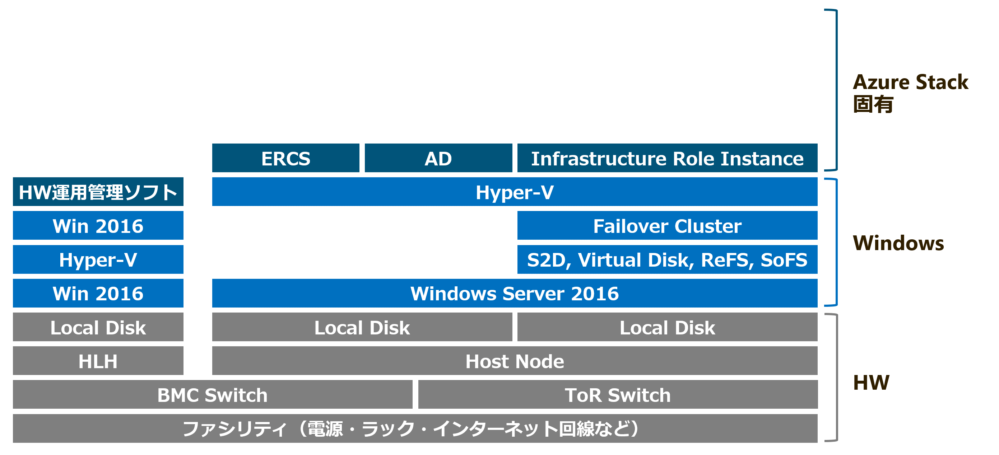

<!-- _class: lead -->
<!-- _backgroundColor: #0078D7 -->
<!-- _color: white -->

# なれる！Azure Stack Operator

---

## 自己紹介

- 松本雄介
- SIer 勤務
- Azure と Azure Stack のプリセールス・設計・構築・技術評価
- IaaS とハイブリッドネットワークが得意分野
- Azure Stack integrated system を導入して、約2年運用中
- Microsoft MVP for Microsoft Azure (2019/5~)

---

## アジェンダ

- Azure Stack Operator とは
- Azure Stack の運用
    - キャパシティ管理
    - 監視
    - 障害対応
    - バックアップ
    - パッチ適用・アップデート

---

## 本セッションのゴール

- Azure Stack Operator という役割を知る
- Azure Stack Operator の仕事を知る

---

## 前提条件

- Dell EMC Cloud for Microsoft Azure Stack 13G
- 2019/04時点での実装・情報・運用経験
- IaaS までの話。PaaS の運用は対象外

---

## その他

- 本セッションは個人的なものであり、所属組織の立場や意見を代表するものではありません

---

<!-- _class: lead -->
<!-- _backgroundColor: #0078D7 -->
<!-- _color: white -->

# Azure Stack Operator とは

---

## そもそも Azure Stack とは

### Azure Stack とは

- 誤：Hyper-V ベースの仮想基盤
- 正：アプライアンス型 Azure 

---

## そもそも Azure Stack とは

### Azure Stack とは

- 誤：Hyper-V ベースの仮想基盤
- 正：アプライアンス型 Azure 

### Azure Stack の運用方法

- 誤：Windows Server として運用する
- 正：アプライアンスのように運用する

---

## Azure Stack の構成要素

---

## Azure Stack の構成要素

---

## Azure Stack の構成要素

---

## Azure Stack の構成要素

---

## Azure Stack の構成要素

---

## Azure Stack の構成要素

---

## Azure Stack の構成要素

---

## Azure Stack の構成要素

### Windows Server ベースの仮想基盤とは全く違う

---

## 新しい役割 - Azure Stack Operator -

<!-- _footer: https://azure.microsoft.com/en-us/blog/why-your-team-needs-an-azure-stack-operator/ -->

---

## Azure Stack Operator の仕事

### Azure Stack というパブリッククラウドを運用管理する

- キャパシティ管理
- 監視
- 障害対応
- バックアップ
- パッチ適用・アップデート

<!-- _footer: https://azure.microsoft.com/en-us/blog/operating-azure-stack/ -->

---

<!-- _class: lead -->
<!-- _backgroundColor: #0078D7 -->
<!-- _color: white -->

# Azure Stack 運用その１
# キャパシティ管理

---

## その１：キャパシティ管理

### Microsoft は Azure のキャパシティを管理している

- パブリッククラウドのリソースは有限
- 万人に無限のリソースを使わせてはならない
- 利用者の使えるリソースに制限をかける

---

## その１：キャパシティ管理

### Azure Stack のリソースも有限

- Host Node のリソースには限りがある
- 利用者に無限のリソースを使わせてはならない
- 利用者の使えるリソースに制限をかける

---

## その１：キャパシティ管理

### リソースに制限をかける

- Quota：リソースプロバイダごとの制限
- Plan：複数の制限をまとめる
- Offer：利用者向けにPlanをまとめる
- User Subscription：ユーザとOfferを紐づける

<!-- _footer: https://docs.microsoft.com/ja-jp/azure/azure-stack/azure-stack-plan-offer-quota-overview -->

---

## その１：キャパシティ管理

### Quota

リソースプロバイダごとに制限を決める

---

## その１：キャパシティ管理

### Plan

リソースプロバイダごとに作成した制限(=Quota)を一つにまとめる

---

## その１：キャパシティ管理

### Offer
- 利用者向けに Plan をまとめる
- 誰でも使える Public Offer と、利用者を指定する Private Offer がある

---

## その１：キャパシティ管理

### Azure の PAYG サブスクリプションは Public Offer

---

## その１：キャパシティ管理

### User Subscription

- Azure Active Directory のユーザを Offer と紐づける
- 紐づけた AAD のユーザでユーザ向けポータルにログインすると、サブスクリプションがある

---

## その１：キャパシティ管理

### もしリソースを使いきったら？

- 既存の Azure Stack にサーバを追加する
- 16台の上限まではサーバを追加できる

---

## その１：キャパシティ管理

### もし16台まで増設してしまったら？

- 新しい Azure Stack 一式を買う。ただし、既存の Azure Stack とは別環境になってしまう
- 既存の Azure Stack に別の Azure Stack 一式を追加する機能(Multi scale unit)が開発中

<!-- _footer: https://azure.microsoft.com/en-us/roadmap/azure-stack-integrated-systems-support-for-multiple-scale-units/ -->

---

<!-- _class: lead -->
<!-- _backgroundColor: #0078D7 -->
<!-- _color: white -->

# Azure Stack 運用その2
# 監視

---

## その2：監視

### Azure Stack というアプリケーションが監視する範囲

---

## その2：監視

### OEM ベンダのソフトウェアが監視する範囲

---

## その2：監視

### Azure Stack が、自分自身を監視する

- Health Resource Provider が、各コンポーネントのイベントとメトリクス、ログをチェックしている

### エージェント型監視は無理

- Internals are internal.
- サーバ内部にアクセスできないので、エージェントをインストールできない

<!-- _footer: https://sec.ch9.ms/sessions/ignite/2016/BRK3115.pptx -->

---

## その2：監視

### 監視結果は API で公開される

- Alerts、Region Health、Resource Healths、Resource Provider State
- 外部に通知する機能（メールや Trap など）はない
- 監視結果をポータルで見られる。けど、24/365目視監視は・・・

---

## その2：監視

### 外部から API を叩いて監視する仕組みが別途必要
- 一般公開されているものは3つ
  - SCOM Management Pack
  - Nagios
  - Log Analytics
- Microsoft は SCOM MP を継続的にメンテ中
- Zabbix はまだない模様？

---

## その2：監視

### OEM ベンダのソフトウェアがハードウェアを監視する

- ハードウェアベンダのツールでサーバ・ネットワーク機器を監視する
- 従来オンプレ運用と同じ世界

### 他の監視サーバを使ってもよい

- HLH はシングル。監視がシングル？
- 従来のオンプレ運用と同じ世界＝使い慣れた監視サーバで監視

---

<!-- _class: lead -->
<!-- _backgroundColor: #0078D7 -->
<!-- _color: white -->

# Azure Stack 運用その3
# 障害対応

---

## その3：障害対応

### アラートメッセージの修復方法に従う

- アラートメッセージに修復方法（REMEDIATION）が書いてある
- 基本的には「ログ取ってサポートに送れ」
- なぜなら、Internals are internal
- 原則、自分で直せません

---

## その3：障害対応

### ソフトウェアなトラブル＝Microsoft が対応

- Azure ポータルからサポートをあげる
- サポート担当からログ取得の依頼を受ける
- ログを取得してアップロードする
- 原因を特定したサポート担当に直してもらう

---

## その3：障害対応

### ハードウェアなトラブル＝OEM ベンダが対応

- HDD が壊れた、電源が壊れた といったケース
- 基本的には、いわゆるハードウェア保守対応と同じ

---

## その3：障害対応

### Azureポータルからサポートをあげる

---

## その3：障害対応

### サポート担当からログの提供を依頼される

---

## その3：障害対応

### ポータルからログをアップロードする

ポータルのログアップロード機能を利用して、サポートの Blob にアップロード

---

## その3：障害対応

### ERCS からログをアップロードする

- ERCS 上で Get-AzureStackLog を実行する。オプションが複雑
- ERCS_AzureStackLogs.ps1 という便利スクリプトを使うと、GUI で簡単にログをとれる
- 数 GB のログファイルをサポートチームの Blob にアップロードする

---

<!-- _class: lead -->
<!-- _backgroundColor: #0078D7 -->
<!-- _color: white -->

# デモ：ログ取り
---

## その3：障害対応

### サポート担当に直してもらう
- Internals are internal. 内部を自由に操作できるのは Microsoft のみ
- サポート担当と画面共有したうえで、リモートでサポート担当に操作してもらう
- リモートでサポート担当に指示してもらいながら自分で操作する

---

## その3：障害対応

### サポート担当に直してもらう

- 普段の ERCS は PowerShell が制限されている（Privileged EndPoint）
- Internals are internal
- 全てのコマンドが実行できると、利用者に内部構造をいじられる
- Just Enough Administrator を利用して、利用できるコマンドを制限している

---

<!-- _class: lead -->
<!-- _backgroundColor: #0078D7 -->
<!-- _color: white -->

# デモ：Privileged EndPoint

---

## その3：障害対応

### ERCSの真の力を開放する

- 制限されたコマンドだけでは復旧作業ができない
- Get-SupportSessionToken を実行して Token を生成する
- 生成された Token を Teams のチャットで サポート担当に渡す

---

## その3：障害対応

### ERCSの真の力を開放する

- サポート担当が制限解除の Token をくれる
- Unlock-SupportSession の引数に Token を入力する。
- ERCS が真の姿を現す。通常の PowerShell を使って復旧作業

---

## その3：障害対応

### 自己診断：Test-AzureStack

- コマンド1つで Azure Stack の状況を診断できる
- 一連の項目を網羅的に自己診断
- 診断結果を視覚的にわかりやすく表示
- FAIL がでたらピンチ

---

## その3：障害対応

### 診断に失敗しても Test-AzureStack

診断に失敗すると、-Repair オプションを利用した修復をお勧めされる

---

## その3：障害対応

### -Repair すると、修復してくれる

意図せず停止した Infrastructure Role Instance を起動してくれた図

---

## その3：障害対応

### 自己診断：Azure Stack Validation Summary

- Test-AzureStack の詳細がまとまった HTML ファイル
- 何を自己診断しているのか、何が失敗したのかが分かる
- ポータルからは見ることのできない
低レイヤな情報が満載。
ちょっと楽しい

---

<!-- _class: lead -->
<!-- _backgroundColor: #0078D7 -->
<!-- _color: white -->

# Azure Stack 運用その4
# 障害対応

---

## その4：バックアップ

### Azure Stackの全損に備えてバックアップを取る

- 保存先は Azure Stack 外部のファイルサーバ
- バックアップのサイズが認証方式によって異なる
  - ADFS 20GB、AAD 1GB
- スケジュールバックアップと世代管理が可能
- 証明書でバックアップファイルを暗号化
  - 自己証明書でもよい

---

## その4：バックアップ

### バックアップの対象

- バックアップには Azure Stack の構成情報のみが保存される
- Azure Stack 上の Azure で作ったリソースやデータは、Azure Stack のバックアップに含まれない
- Azure Stack 上の Azure で作ったリソースとデータを保護する責任は利用者にある

---

## その4：バックアップ

### バックアップの対象

- バックアップの範囲を利用者に説明すること
- ユーザ側はサブスクリプション、RBAC、KeyVaultだけが戻る
- 上記以外は全滅の模様

---

<!-- _class: lead -->
<!-- _backgroundColor: #0078D7 -->
<!-- _color: white -->

# Azure Stack 運用その5
# パッチ適用・アップデート

---

## その5：パッチ適用・アップデート

---

## その5：パッチ適用・アップデート

---

## その5：パッチ適用・アップデート

---

## その5：パッチ適用・アップデート

---

## その5：パッチ適用・アップデート

### Microsoft 提供 Azure Stack Update

-  1か月に1回、アップデートがリリースされる
   - Windows Update の更新プログラム（該当する KB だけ）
   - Azure Stack というアプリケーションの更新パッケージ
- サポートされるのは２つ前のバージョンまで
  - アップデートするしかない
  - 累積アップデートがないので、順番に適用する

---

## その5：パッチ適用・アップデート

### Full vs Express

- Full
  - Windows Update を含む Update
  - Host Node の再起動を伴うため、適用時間が長い
- Express
  - Windows Update を含まない Update
  - Host Node の再起動を伴わず、Full よりも適用時間が短い

---

## その5：パッチ適用・アップデート

### アップデート作業は簡単

- Azure Stack 自身がアップデートと Hotfix の有無をチェック
- もしアップデートか Hotfix がリリースされた場合、Azure Stack 自身が必要なファイルをダウンロードする
- ボタンをぽちっとな。終わるまで待つ

---

## その5：パッチ適用・アップデート

### アップデート作業は全自動

- 大量のステップを自動的に順番に
- 複数台のコンポーネントは1台ずつアップデートされる
- 利用者が作成した Virtual Machine はライブマイグレーションされる
- 作業は楽。だたし、所要時間が異様に長い
  - リリースノートで想定所要時間がアナウンスされる

---

## その5：パッチ適用・アップデート

### アップデートに失敗したら

- アップデート中に異常が起きると、そのステップで一旦停止
- サポートと協力して問題を解決
- 問題を解決できたらアップデートを Resume する。一時停止したステップから再開
- 切り戻しなしの片道切符

---

## その5：パッチ適用・アップデート

---

## その5：パッチ適用・アップデート

### OEM ベンダ提供 Azure Stack Update

- OEMベンダのサポートページでアップデート用のパッケージが配信される
- サーバのドライバが含まれている
- パッケージをダウンロードして、Azure Stack上のストレージアカウントにアップロードする
- ボタンをぽちっとな。終わるまで待つ
- Host Node のイメージを作り直す場合、それなりに時間がかかる

---

## その5：パッチ適用・アップデート

---

## その5：パッチ適用・アップデート

### OEM ベンダ提供 Hardware/Software Update

- OEM ベンダの仕組みに従って対応。ベンダごとに手順が違う。簡単な手順でアップデートを実施できるOEMベンダがおすすめ
  - Host Node と HLH のファームウェアを更新する
  - HLH のドライバを更新する
  - HLH と HW 運用管理 VM に Windows Updateを適用する
  - HW運用管理ソフトウェアを更新する
  - スイッチのファームウェアを更新する

---

<!-- _class: lead -->
<!-- _backgroundColor: #0078D7 -->
<!-- _color: white -->

# まとめ

---

## まとめ

- Azure Stack Operator とは
- Azure Stack の運用
    - キャパシティ管理
    - 監視
    - 障害対応
    - バックアップ
    - パッチ適用・アップデート

--- 

## Ask the speaker!

- Azure Stack の QA セッションに参加します
- お気軽にご質問ください！
